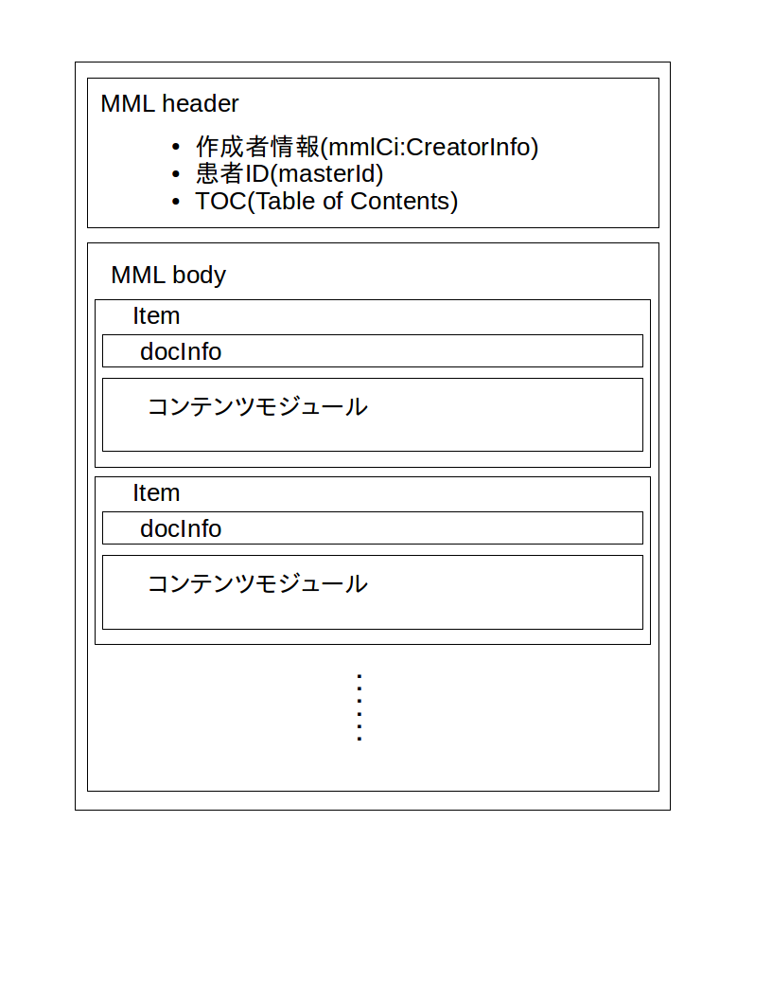

:Author: Shinji KOBAYASHI
:Email: skoba@moss.gr.jp
:toc: right
:toclevels: 2
:pagenums:
:numberd:
:sectnums:
:imagesdir: ./figures
:linkcss:

== MML構造概説
toc::[]

MMLはheader部分とbody部分の2つのブロックで構成される(Figure 1)。Header部分にはすべてのMMLインスタンスに共通の情報が定義されており、Body部分には個別のユースケースに対応したコンテンツモジュールが組み込まれるようになっている。

.MMLの構造

=== MML headerブロック

MML headerはMML作成者情報(mmlCi:CreatorInfo)、患者ID(masterId)、toc(Table of Contents)情報で構成される。SAXパーサではこのtoc情報を見ることで、MML bodyブロックに記載されるコンテンツモジュールの内容を認識し、それに応じて条件分岐させることができる。

=== MML bodyブロック

MML bodyブロックは複数のitemブロック（MmｌModuleItem)で構成されており、各itemブロックにはヘッダ情報（docInfo)とその内容を表すコンテンツモジュールが配置される。

docInfoには、記載日、記載者、文書種別、タイトル、文書ID、親文書ID、グループID、アクセス権、外部参照リストが記載されている。

各itemブロックには下記のモジュールのいずれか一つが格納される。

* 患者情報
* 保険情報
* 診断履歴情報
* 生活習慣情報
* 基礎的診療情報
* 初診時特有情報
* 経過記録情報
* 手術記録情報
* 臨床サマリー情報
* 検歴情報
* 報告書情報
* 紹介状
* バイタルサイン
* 体温表
* 処方箋
* 注射記録
* 透析

=== MML共通形式

複数のモジュールで共通して利用される情報モデルは以下のMML共通形式としてまとめられている。

* 住所表現形式
* 電話番号表現形式
* Id形式
* 外部参照形式
* 人名表現形式
* 施設情報形式
* 個人情報形式
* 作成者情報形式

ただし、上位モジュールの違いにより使用するテーブルが異なることがあるため、実装の際には各モジュールの解説で確認しなければならない。
